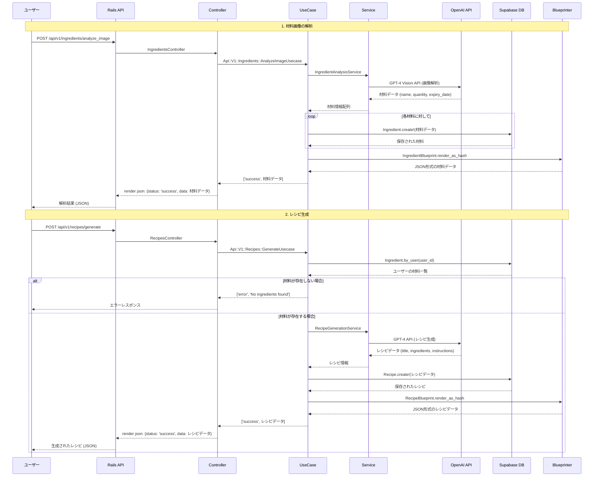
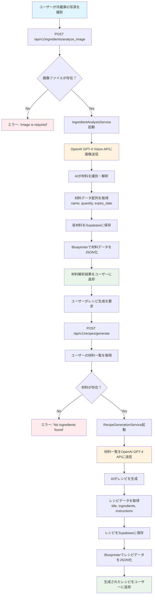
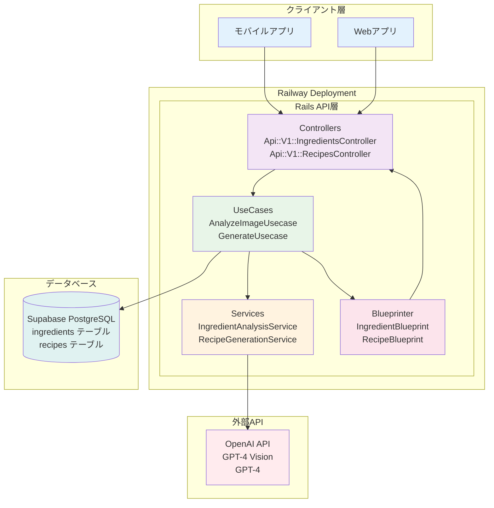

# 冷蔵庫AI API フロー図

このドキュメントでは、冷蔵庫AI APIの処理フローを図解で説明します。

## 概要

冷蔵庫AI APIは以下の主要機能を提供します：

1. **画像解析**: 冷蔵庫の写真からAIが材料を識別
2. **材料管理**: 識別された材料をデータベースに保存・管理
3. **レシピ生成**: 保存された材料を基にAIがレシピを自動生成

## シーケンス図（材料画像からレシピ生成まで）



## フローチャート（全体の処理フロー）



## アーキテクチャ構成図



## API エンドポイント一覧

### 材料関連
- `GET /api/v1/ingredients` - 材料一覧取得
- `POST /api/v1/ingredients` - 材料作成
- `GET /api/v1/ingredients/:id` - 材料詳細取得
- `PUT /api/v1/ingredients/:id` - 材料更新
- `DELETE /api/v1/ingredients/:id` - 材料削除
- `POST /api/v1/ingredients/analyze_image` - 画像解析による材料追加

### レシピ関連
- `GET /api/v1/recipes` - レシピ一覧取得
- `POST /api/v1/recipes` - レシピ作成
- `GET /api/v1/recipes/:id` - レシピ詳細取得
- `DELETE /api/v1/recipes/:id` - レシピ削除
- `POST /api/v1/recipes/generate` - AIによるレシピ自動生成

## 技術スタック

### バックエンド
- **フレームワーク**: Ruby on Rails 7.2.0
- **言語**: Ruby 3.1.0
- **アーキテクチャ**: UseCase パターン
- **JSON シリアライゼーション**: Blueprinter

### データベース
- **データベース**: Supabase PostgreSQL
- **ORM**: Active Record

### 外部サービス
- **AI画像解析**: OpenAI GPT-4 Vision API
- **AIレシピ生成**: OpenAI GPT-4 API

### デプロイメント
- **プラットフォーム**: Railway
- **Webサーバー**: Puma

### セキュリティ・設定
- **CORS**: rack-cors
- **環境変数管理**: dotenv-rails
- **認証**: ヘッダーベース (X-User-ID)

## レスポンス形式

### 成功レスポンス
```json
{
  "status": "success",
  "data": {
    // Blueprinterでシリアライズされたデータ
  }
}
```

### エラーレスポンス
```json
{
  "status": "error",
  "data": "エラーメッセージ"
}
```

## データベーススキーマ

### ingredients テーブル
```sql
CREATE TABLE ingredients (
  id UUID DEFAULT gen_random_uuid() PRIMARY KEY,
  user_id UUID REFERENCES auth.users(id),
  name TEXT NOT NULL,
  quantity TEXT,
  expiry_date DATE,
  image_url TEXT,
  created_at TIMESTAMP DEFAULT NOW(),
  updated_at TIMESTAMP DEFAULT NOW()
);
```

### recipes テーブル
```sql
CREATE TABLE recipes (
  id UUID DEFAULT gen_random_uuid() PRIMARY KEY,
  user_id UUID REFERENCES auth.users(id),
  title TEXT NOT NULL,
  ingredients JSONB,
  instructions TEXT,
  created_at TIMESTAMP DEFAULT NOW(),
  updated_at TIMESTAMP DEFAULT NOW()
);
```

## デプロイ情報

- **本番環境URL**: https://web-production-b2c5.up.railway.app/
- **ヘルスチェック**: https://web-production-b2c5.up.railway.app/health
- **GitHubリポジトリ**: https://github.com/Tonny4196/fridge-ai-api

---

*このドキュメントは冷蔵庫AI APIの技術仕様と処理フローを説明しています。*